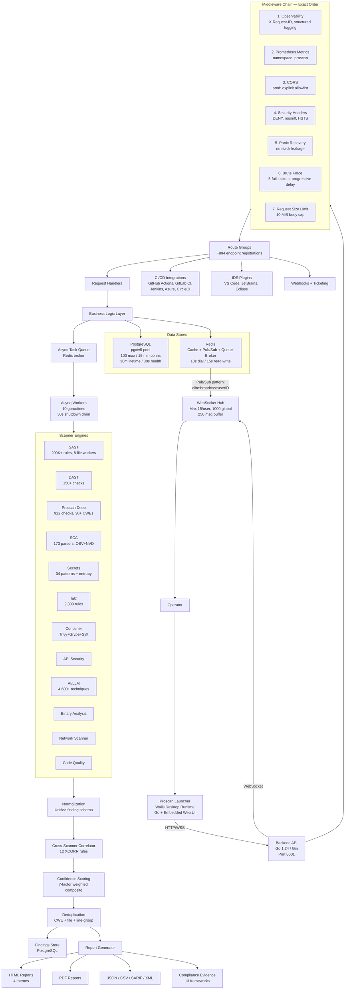
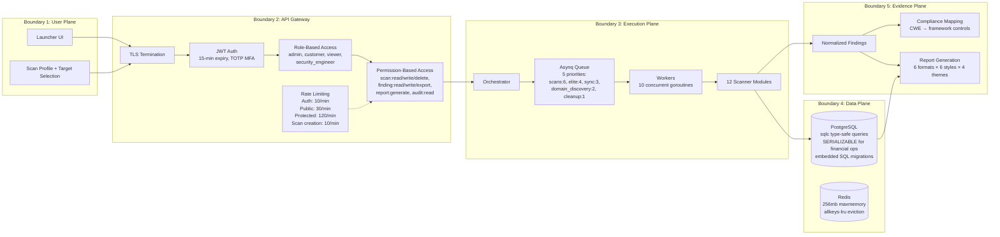
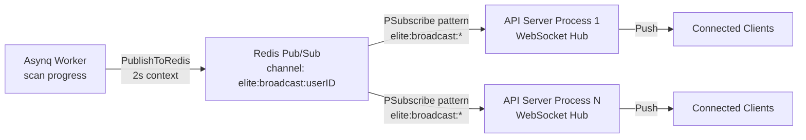

# Proscan Application Architecture

This document describes the full system architecture with real component names, protocols, data stores, configuration values, and trust boundaries.

---

## 1) End-to-End System Diagram

## 2) Trust Boundaries

## 3) Database Architecture

### 3.1 Connection Pool (pgx/v5)

| Parameter | Value |
|-----------|-------|
| MaxConns | 100 |
| MinConns | 15 |
| MaxConnLifetime | 30 minutes |
| MaxConnIdleTime | 10 minutes |
| HealthCheckPeriod | 30 seconds |
| Connect timeout | 10 seconds |
| Connect retries | 5 (exponential backoff + jitter) |
| Ping timeout | 5 seconds |
| Health pool | Separate: 5 max / 2 min connections |
| Monitoring | Log warning when acquired ≥ 80% of max |

### 3.2 Query Layer

All database queries use **sqlc**-generated type-safe Go code — no raw SQL string construction in application handlers.

### 3.3 Migrations

- Embedded SQL files applied at startup
- Per-migration transaction with **2-minute timeout**
- Stop on first failure
- Post-migration schema validation on financial columns (NUMERIC type enforcement for `users.balance`, `transactions.amount`, `crypto_payments.price_amount`)
- Admin bootstrap via `ADMIN_PASSWORD` environment variable (5-second timeout)

### 3.4 Financial Data Integrity

All financial operations use `SERIALIZABLE` transaction isolation. Amount fields use PostgreSQL `NUMERIC` type. Explicit NaN/Inf/non-positive rejection before balance credits. Idempotency guards via `sync.Map` with TTL pruning.

## 4) Task Queue Architecture

### 4.1 Asynq Configuration

| Parameter | Value |
|-----------|-------|
| Worker concurrency | 10 goroutines |
| Shutdown timeout | 30 seconds |
| Retry delay | 10 × 2^n seconds, capped at 5 minutes |
| Redis dial timeout | 10 seconds |
| Redis read/write timeout | 15 seconds |

### 4.2 Queue Priorities

| Queue | Priority Weight |
|-------|----------------|
| scans | 6 |
| elite | 4 |
| sync | 3 |
| domain_discovery | 2 |
| cleanup | 1 |

### 4.3 Scheduled Tasks

| Schedule | Task | Purpose |
|----------|------|---------|
| `0 2 * * *` | maintenance:cleanup | Clean old scans, expire deposits |
| `*/5 * * * *` | scan:sync_vulnerabilities | Vulnerability synchronization |

### 4.4 Registered Task Types

`scan:web`, `scan:elite`, `scan:subfinder`, `scan:ffuf`, `scan:nuclei`, `scan:network`, `scan:network_discovery`, `scan:cve_sync`, `scan:sync_vulnerabilities`, `scan:cleanup`, `domain:analysis`, `maintenance:cleanup`, `payments:verify`, `sync:daily`, `workflow:execute`, `workflow:node`, `trending:snapshot`, `agent:task`.

## 5) Resilience Architecture

### 5.1 Circuit Breaker (sony/gobreaker)

Per scanning server, keyed by `server:{id}`:

| Parameter | Value |
|-----------|-------|
| MaxRequests (half-open) | 5 |
| Failure count interval | 30 seconds |
| Open → half-open timeout | 120 seconds |
| Trip condition | ≥5 requests AND ≥80% failure ratio |
| Success override | 404 / "not found" / "initializing" treated as success |

Admin manual actions: retry now, disable, cooldown.

### 5.2 Degraded Mode

Thread-safe per-feature health map. When ML classifier, OIDC, or external services are unavailable, the feature is marked degraded with reason and timestamp. Dependent code paths check degradation state and fall back to heuristic alternatives.

### 5.3 DB Cache

In-memory key-value cache with dual TTL:

| Parameter | Value |
|-----------|-------|
| Fresh TTL | 5 minutes |
| Stale window | 30 minutes |
| Eviction cycle | Every 1 minute |
| Behavior | Serve stale if refresh fails |

## 6) HTTP Server Configuration

| Parameter | Value |
|-----------|-------|
| Default port | 8001 |
| ReadTimeout | 10 minutes |
| WriteTimeout | 10 minutes |
| ReadHeaderTimeout | 10 seconds |
| IdleTimeout | 120 seconds |
| MaxHeaderBytes | 1 MiB |
| Multipart memory | 32 MiB |
| API context deadline | 60 seconds |
| TLS | Optional (cert/key path config) |

## 7) WebSocket Broadcasting

| Parameter | Value |
|-----------|-------|
| Max connections per user | 15 |
| Max global connections | 1,000 |
| Message channel buffer | 256 |
| Publish context timeout | 2 seconds |
| Fallback (no Redis) | Local in-process broadcast |

## 8) Background Services

| Service | Interval | Purpose |
|---------|----------|---------|
| License monitor | 60 seconds | Periodic license validation |
| Stalled scan monitor | 5 minutes | Detect and recover stuck scans |
| SaaS scan processor | 30 seconds | Process queued SaaS scan requests |
| Sync cache cleanup | 7 days | Purge stale synchronization cache |
| Webhook event pruner | Background | Clean delivered webhook events |
| Notification pruner | Background | Clean sent notification records |
| Payment pruner | Background | Clean processed payment records |
| SCA cleanup | Background | Remove stale SCA artifacts |
| Connection pool monitor | 30 seconds | Log when pool utilization ≥ 80% |

## 9) Startup and Shutdown

### 9.1 Startup Sequence (18 Steps)

1. Anti-debug and system resource checks
2. GOMAXPROCS = max(2, numCPU/2); GOGC = 50
3. .env file search (current dir, ../backend, ../../backend)
4. Configuration load + rule file system embedding
5. Structured logging (slog, JSON format)
6. OpenTelemetry tracing (optional)
7. Tool manager: nuclei, ffuf, subfinder download/path resolution
8. PostgreSQL: connect pool + migrations + schema validation + admin bootstrap
9. Background pruners start (webhooks, notifications, payments, SCA)
10. License validator + 60-second monitor
11. Degraded mode tracker + DB cache (5m/30m)
12. Stalled scan monitor (5-minute interval)
13. SaaS scan processor (30-second interval)
14. FFuf scan manager + vulnerability sync manager
15. Redis pub/sub broadcast subscriber
16. Asynq worker + scheduler (conditional on START_WORKER=true)
17. Gin router with middleware chain + route registration
18. HTTP server listen

### 9.2 Graceful Shutdown

Signal: SIGINT or SIGTERM → cancel server context → 5-second drain timeout → `srv.Shutdown` → stop monitors → close DB cache → shutdown tracer.
