# Scanner Architecture Diagrams

This document provides architecture-level diagrams and technical internals for each Proscan scanner module. All numbers and configuration values are from the production codebase.

---

## Common Scanner Contract

All scanners produce output conforming to a shared normalized schema. After scanner-specific detection, findings enter the cross-scanner merge pipeline:

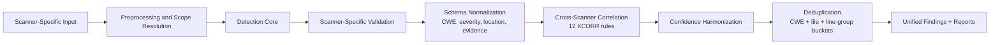

---

## 1) SAST — Static Application Security Testing

### Architecture

```mermaid
flowchart TB
    Source[Source Files<br/>221 supported extensions] --> FileWorkers[8 Concurrent File Workers<br/>2 MiB max file size]

    FileWorkers --> RuleEngine[Rule Engine<br/>420 rule sets<br/>200,000+ compiled rules]

    subgraph Detection[Multi-Method Detection]
      Regex[Regex Pattern Matching<br/>per-line + 5-line snippet join]
      AST[AST Analysis<br/>per-language analyzers]
      Taint[Advanced Taint Engine<br/>136 sources / 84 sinks / 205 sanitizers<br/>max call depth: 5]
      Direct[Direct Injection Detector<br/>same-line + 30-line variable tracking]
      Context[Contextual Pattern Matcher<br/>10-15 line non-comment window]
    end

    RuleEngine --> Detection

    Detection --> Suppression[11-Stage FP Suppression Pipeline]

    subgraph Suppression[FP Suppression Pipeline]
      S1[1. Rule negative pattern]
      S2[2. Auto-extracted negatives]
      S3[3. Comment line detection]
      S4[4. Rule definition line detection]
      S5[5. Data/string literal detection]
      S6[6. Library-only rule filtering]
      S7[7. Test/benchmark path filtering]
      S8[8. Go stdlib FP exclusions]
      S9[9. Context window validation]
      S10[10. Non-code file filtering]
      S11[11. Go var declaration filtering]
    end

    Suppression --> PostScan[Post-Scan Validation]

    subgraph PostScan[Post-Scan Validation]
      FPMem[FP Memory<br/>historical tracking]
      FPElim[FP Eliminator<br/>test file, test code, comment,<br/>dead code, framework suppression]
      Conf[Deep Confidence Scorer<br/>7-factor weighted composite<br/>drop threshold: 0.3]
      DynSev[Dynamic Severity Adjustment]
      Strip[Low-confidence / INFO stripping]
    end

    PostScan --> Findings[SAST Findings<br/>max 1 hit per rule per file<br/>max 10,000 per scan]
```

### Taint Analysis Detail

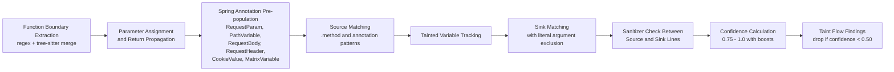

**Language coverage for taint catalog:** Go, Python, JavaScript, Java, C#, Ruby, PHP, Kotlin, TypeScript, Rust, Swift.

**Vulnerability classes tracked:** SQL injection, command injection, XSS, SSRF, path traversal, open redirect, deserialization, XXE, LDAP injection, NoSQL injection, SSTI, log injection.

### Confidence Scorer Formula

```
FinalScore = BaseConfidence × 0.25
           + SeverityBoost
           + PatternSpecificity × 0.15
           + CodeContext × 0.20
           + HistoricalTPRate × 0.15
           + FileReputation × 0.10
           + EnvironmentFactor × 0.15
```

Clamped to [0, 1]. Findings below 0.3 are dropped.

| Factor | Range | Notes |
|--------|-------|-------|
| BaseConfidence | 0.5 – 0.9 | From rule definition |
| SeverityBoost | 0 – 0.15 | Critical +0.15, high +0.10, medium +0.05 |
| PatternSpecificity | 0.1 – 1.0 | Dangerous substring density; −0.2 if line < 20 chars |
| CodeContext | 0.1 – 1.0 | Path heuristics (todo/mock/vendor/generated) |
| HistoricalTPRate | 0.0 – 1.0 | Requires 10+ fires; else 0.7 |
| FileReputation | 0.0 – 1.0 | Requires 5+ findings; else 0.5 |
| EnvironmentFactor | 0.2 – 0.9 | Production 0.9, test 0.3, examples 0.2, vendor 0.4 |

---

## 2) DAST — Dynamic Application Security Testing

### Architecture

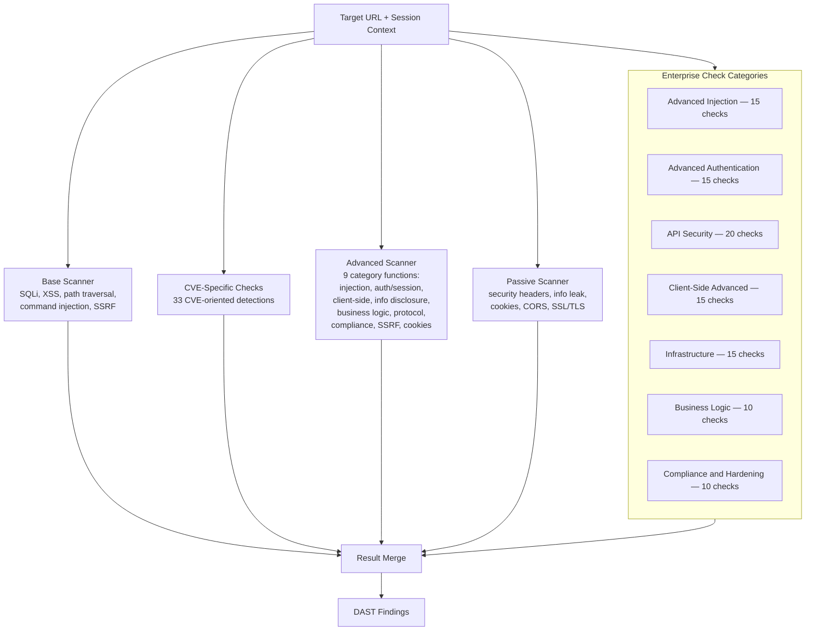

### Check Scale Summary

| Layer | Check Count |
|-------|------------|
| Base active checks | 5 vulnerability types |
| Enterprise checks | 100 (7 categories) |
| CVE-specific | 33 |
| Advanced category functions | 9 |
| Passive analysis | Security headers, cookies, CORS, SSL/TLS |
| **Total** | **150+** |

---

## 3) Proscan Deep (Elite Engine)

The largest scanner module: **605 Go source files**, **922 registered security checks**, **30+ CWE categories**, **20 concurrent test groups**.

### Full Lifecycle Architecture

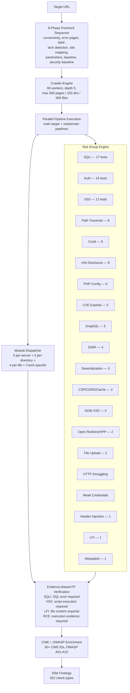

### CWE Coverage (30+ Categories)

CWE-22, CWE-74, CWE-78, CWE-79, CWE-89, CWE-90, CWE-94, CWE-98, CWE-113, CWE-200, CWE-235, CWE-284, CWE-287, CWE-295, CWE-310, CWE-350, CWE-352, CWE-362, CWE-434, CWE-444, CWE-489, CWE-502, CWE-540, CWE-601, CWE-611, CWE-639, CWE-643, CWE-644, CWE-693, CWE-918, CWE-942, CWE-943, CWE-1021, CWE-1333.

### Embedded Data Scale

| Dataset | Scale |
|---------|-------|
| Proscan checks catalog | 922 checks |
| Tech-to-vulnerability mappings | ~65,000 |
| Tool-specific mappings | ~21,000 |
| Binary analysis strings | 138,000+ |
| Algorithm strings | 617,000+ |

### Configuration Defaults

| Parameter | Value |
|-----------|-------|
| Crawl depth | 5 |
| Max concurrent | 100 |
| Crawler workers | 60 |
| Max pages / dirs / files | 300 / 150 / 600 |
| Scan timeout | 30 minutes |
| RPS limit | 100 |
| Blind SQLi threshold | 1 second |
| Differential threshold | 0.15 |
| Resource governor | 5,000 goroutines |
| Asynq task timeout | 24 hours |

---

## 4) SCA — Software Composition Analysis

### Architecture

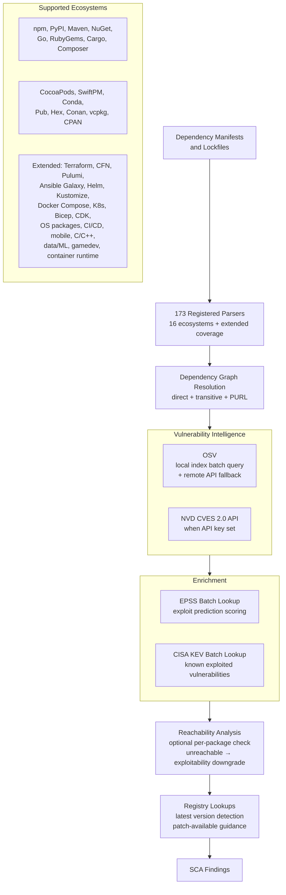

---

## 5) Secrets Detection

### Architecture

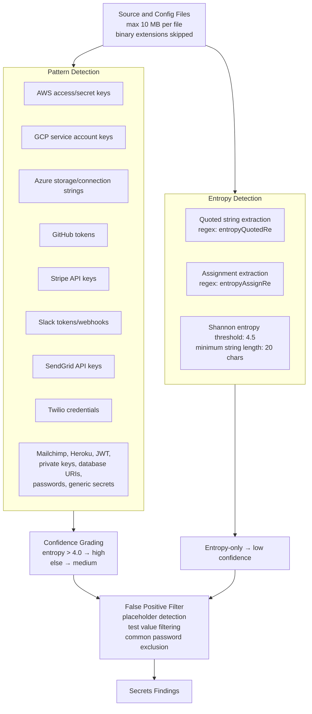

---

## 6) IaC Security

### Architecture

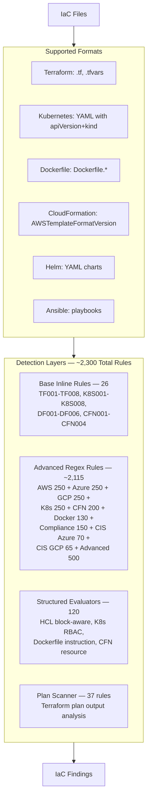

---

## 7) Container Security

### Architecture

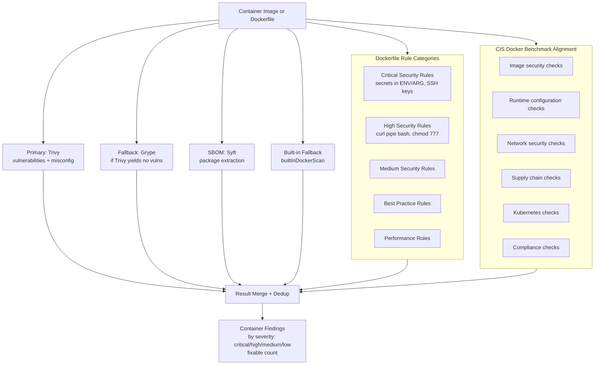

---

## 8) API Security

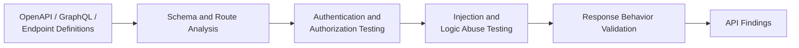

API security testing is schema-driven: endpoints are tested for authentication bypass, authorization flaws, injection vulnerabilities, and business logic abuse based on the API specification.

---

## 9) AI/LLM Security

### Architecture

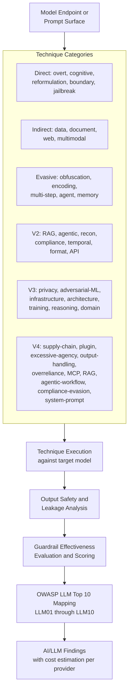

---

## 10) Binary Analysis

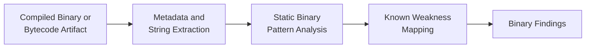

---

## 11) Network Scanner

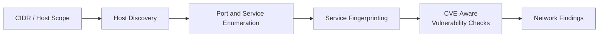

---

## 12) Code Quality

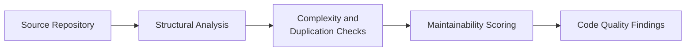

---

## Cross-Scanner Correlation Engine

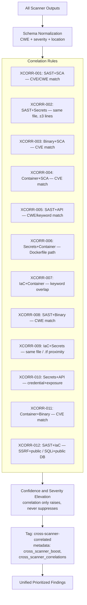

### Correlation Design Principles

- Match by target identity (repository, image, endpoint, host)
- Match by weakness class (CWE and scanner-specific category)
- Preserve distinct findings by location grouping (20-line buckets) to prevent over-collapse
- Correlation only elevates confidence — it never suppresses or removes findings
- Correlated findings are tagged with metadata for audit traceability
